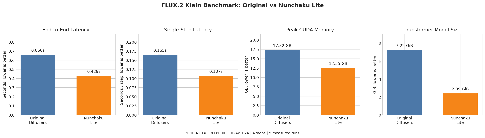
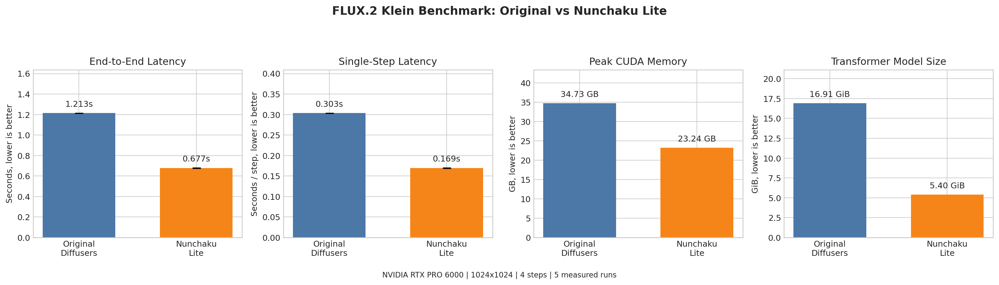
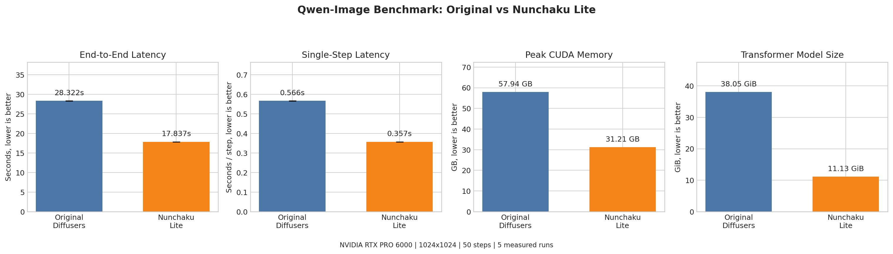

# Benchmarks

`nunchaku_lite` reduces transformer storage and peak CUDA memory while keeping
the normal Diffusers pipeline workflow. The measurements below compare
unmodified Diffusers pipelines against `nunchaku_lite` pipelines loaded with
FP4 SVDQ checkpoints.

All runs used `1024x1024` generation on an NVIDIA RTX PRO 6000, BF16 runtime dtype, 5 measured runs, and 2 warmup runs. Source data is
stored under `outputs/benchmark_*/summary.json`.

## Results

| Model | Steps | Latency | Speedup | Peak CUDA memory | Transformer storage |
| --- | ---: | ---: | ---: | ---: | ---: |
| FLUX.2 Klein 4B | 4 | `0.660s -> 0.429s` | `1.54x` | `17.32 GB -> 12.55 GB` | `7.22 GiB -> 2.39 GiB` |
| FLUX.2 Klein 9B | 4 | `1.213s -> 0.677s` | `1.79x` | `34.73 GB -> 23.24 GB` | `16.91 GiB -> 5.40 GiB` |
| Qwen-Image | 50 | `28.322s -> 17.837s` | `1.59x` | `57.94 GB -> 31.21 GB` | `38.05 GiB -> 11.13 GiB` |
| Z-Image Turbo | 8 | `1.851s -> 1.102s` | `1.68x` | `21.67 GB -> 14.07 GB` | `11.46 GiB -> 3.91 GiB` |

Across this benchmark set, `nunchaku_lite` reaches up to `1.79x` lower latency,
up to `46%` lower peak CUDA memory, and up to `71%` smaller transformer
storage.

## FLUX.2 Klein 4B



Prompt:

```text
A cat holding a sign that says This is Nunchaku Lite
```

| Original Diffusers | nunchaku_lite |
| --- | --- |
|  |  |

## FLUX.2 Klein 9B



Prompt:

```text
A cat holding a sign that says This is Nunchaku Lite
```

| Original Diffusers | nunchaku_lite |
| --- | --- |
|  |  |

## Qwen-Image



Prompt:

```text
A coffee shop entrance features a chalkboard sign reading "This is Nunchaku Lite"
```

| Original Diffusers | nunchaku_lite |
| --- | --- |
|  |  |

## Z-Image Turbo


Prompt:

```text
a cinematic photo of a glass greenhouse full of tropical plants during golden hour, detailed, natural light
```

| Original Diffusers | nunchaku_lite |
| --- | --- |
|  |  |

## Reproducing

The benchmark scripts live under `benchmarks/`. Each script writes generated
images, a `summary.json`, and, when both Diffusers and `nunchaku_lite` are run,
a `comparison.png` chart.

```bash
python benchmarks/benchmark_qwen_image.py \
  --model-id Qwen/Qwen-Image \
  --checkpoint nunchaku-tech/nunchaku-qwen-image/svdq-fp4_r32-qwen-image.safetensors \
  --precision fp4 \
  --dtype bf16 \
  --runs 5 \
  --warmup-runs 2
```
